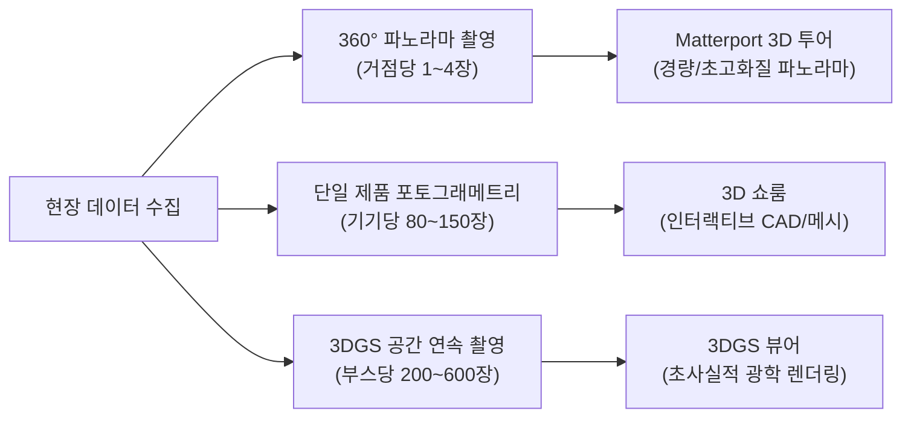

# [가이드북] 공간 디지털 트윈 3종 촬영 프로토콜 및 데이터 구축 사양서
**문서 버전:** v1.0 &nbsp;|&nbsp; **대상:** 디지털 트윈 제작팀, 현장 촬영 감독, 3D 그래픽 엔지니어 &nbsp;|&nbsp; **최종 수정일:** 2026. 08. 23

---

## 📌 개요 및 핵심 요약

디지털 트윈 구축 시 **Matterport 360° 투어**, **3D 쇼룸 (CAD/Interactive)**, **3DGS (Gaussian Splatting) 뷰어**는 목적과 구현 엔진에 따라 **필요한 사진 장수, 촬영 기법, 조명 조건**이 완전히 다릅니다. 본 문서는 현장 촬영 시 오차와 재촬영을 방지하기 위한 표준 가이드라인을 제공합니다.



---

## 📊 1. 핵심 사양 및 촬영 요구사항 비교

| 구분 | 📸 1. Matterport 360° 투어 | 🤖 2. 3D 쇼룸 (제품 메시) | 🌟 3. 3DGS 뷰어 (공간 스플랫) |
| :--- | :--- | :--- | :--- |
| **필요 사진 장수** | **노드(지점)당 1장**<br>(부스 전체 약 **5 ~ 15장**) | **제품 1기당 80 ~ 150장**<br>(360도 돔 형태 캡처) | **부스 전체 200 ~ 600장**<br>(고밀도 오버랩 연속 캡처) |
| **촬영 장비** | 360도 전용 카메라 (Insta360 Pro2, Ricoh Theta X) 또는 DSLR + 어안렌즈 + 파노라마 헤드 | 고해상도 미러리스/DSLR (50mm 표준 렌즈), 삼각대, 턴테이블(소형물) | 미러리스/DSLR (24~35mm 단렌즈), 짐벌(동영상 프레임 추출 가능) |
| **촬영 각도** | **수평 0° (바닥과 수평)**<br>아이레벨(140~160cm) 고정 | **3단 높이 궤적 (15°, 45°, 75°)**<br>제품 중심 10~15° 간격 회전 | **3단 연속 보행 궤적 + 전방향 링**<br>오버랩 70~80% 유지 |
| **셔터/카메라 설정** | HDR 자동 합성 (AEB 3~5컷), 삼각대 필수 | 수동 모드(M), 조리개 F8~F11, ISO 100 고정, CPL 필터 | 수동 모드(M), 빠른 셔터(1/250s 이상), 모션블러 절대 금지 |
| **조명 조건** | 균일한 전체 확산광 (그림자 최소화) | 3점 소프트박스 조명 (반사광 제어) | 현장 실조명 유지 (조명 변화 금지) |

---

## 📸 2. 기술별 상세 촬영 프로토콜 및 필수 요구사항

---

### [구분 1] Matterport 3D 360° 투어

> [!NOTE]
> **기술적 기반:** 2:1 비율의 8K Equirectangular 구체 매핑 + Three.js 구면 좌표계 + 3D 서브픽셀 핀  
> **인터랙션 방식:** 거점 중심 360° 자유 회전, 바닥 링 클릭 순간이동, 핫스팟 스펙 모달  
> **최적의 용도:** 웹 로딩 속도가 중요한 B2B 원격 영업, 가상 박람회 부스 투어, 매장 투어

#### 1) 소스 사진 필요 수량
* **부스/공간당 5 ~ 15장** (전시 부스 18x12m 기준 6~8개 거점 권장)
* 각 관람 지점(입구, 메인 로봇 앞, 물류 존 등)마다 **1장씩** 360 파노라마 이미지 추출.

#### 2) 촬영 각도 및 동선 가이드
* **카메라 높이:** 성인 평균 시야 높이인 **145cm ~ 155cm**에 삼각대 고정.
* **수평계 일치:** 삼각대 헤드의 수평계를 반드시 맞추어 바닥과 천장이 왜곡되지 않도록 수평 0° 유지.
* **촬영 간격:** 거점과 거점 사이 거리는 **1.5m ~ 3m**를 넘지 않도록 배치하여 자연스러운 시야 전환 유도.

```
[ Matterport 거점 배치도 (18x12m 부스 예시) ]
┌──────────────────────────────────────────────┐
│  [거점 4: 후면 상담실]   [거점 5: 제어 관제센터] │
│                                              │
│  [거점 2: AMR 물류존]    [거점 3: CoBot 전시대] │
│                                              │
│               [거점 1: 부스 메인 입구]         │
└──────────────────────────────────────────────┘
```

#### 3) 필수 요구사항 (Do & Don't)
* ✅ **HDR 브라케팅(AEB):** 밝은 LED 전광판과 어두운 바닥의 디테일을 모두 살리기 위해 3~5컷 합성 HDR 촬영 필수.
* ✅ **인물 통제:** 360도 전체가 찍히므로 촬영 반경 내에 사람이 없어야 함 (촬영자는 타이머 사용 후 사각지대에 은신).
* ❌ **렌즈 틸팅 금지:** 카메라가 위나 아래로 기울어지면 파노라마 합성 시 수평선이 휘어 어안 왜곡 발생.

---

### [구분 2] 3D 쇼룸 (제품 메시 / CAD)

> [!NOTE]
> **기술적 기반:** 포토그래메트리(Photogrammetry) 기반 3D 폴리곤 메시 + PBR 텍스처 (GLTF/GLB)  
> **인터랙션 방식:** 6-DoF 궤도 회전, 부품 분해(Exploded View), 로봇 관절 모션 시뮬레이션  
> **최적의 용도:** 제품 기구학적 작동 시연, 엔지니어링 스펙 검토, 1:1 제품 컨피규레이터

#### 1) 소스 사진 필요 수량
* **단일 로봇/장비 1대당 80 ~ 150장** (복잡한 기계 관절의 경우 200장 이상)

#### 2) 촬영 각도 및 궤적 (3단 돔 궤적)
* 제품을 중심으로 **일정한 거리(1.5m~2m)**를 유지하며 원형 궤적으로 3단계 높이에서 촬영:
  1. **하단 링 (15° 각도):** 바닥면, 베이스 플레이트, 하부 조인트 (약 36장, 10° 간격)
  2. **중단 링 (45° 각도):** 로봇 바디, 주요 컨트롤러, 메인 암 (약 36장, 10° 간격)
  3. **상단 링 (75° 俯瞰 각도):** 로봇 엔드이펙터(그리퍼), 상단 조인트 (약 36장, 10° 간격)
  4. **클로즈업(디테일):** 로봇 관절부, 로고 명판, 케이블 체인 등 세부 접사 (20~30장)

```
       [ 상단 링: 75° ]  ↓  (36장)
     [ 중단 링: 45° ]   ↘  (36장)
   [ 하단 링: 15° ]    →  (36장)
   ─────────────────────────────
          [ 🤖 로봇 기기 ]
```

#### 3) 필수 요구사항 (Do & Don't)
* ✅ **심도 확보 (F8 ~ F11):** 핀트가 나간(아웃포커싱) 사진은 3D 메시 생성 알고리즘(RealityCapture, Meshroom)에서 에러를 유발하므로 전체가 선명해야 함.
* ✅ **편광(CPL) 필터 사용:** 금속 프레임이나 아크릴 커버의 난반사(빛 번짐)를 반드시 제거.
* ❌ **조명 변화 금지:** 촬영 도중 플래시를 터뜨리거나 그림자 위치가 바뀌면 텍스처 베이킹 시 얼룩 발생.

---

### [구분 3] 3DGS 뷰어 (Gaussian Splatting)

> [!NOTE]
> **기술적 기반:** 3D Gaussian Splatting (COLMAP SfM + 포인트 클라우드 래스터라이징)  
> **인터랙션 방식:** 공간 전체를 끊김 없이 자유 비행(Free-Fly), 초사실적 반사광/굴절 표현  
> **최적의 용도:** 차세대 VR/AR 공간 컴퓨팅, 미려한 조명 연출이 포함된 프리미엄 공간 아카이빙

#### 1) 소스 사진 필요 수량
* **부스 전체 기준 200 ~ 600장** (고밀도 오버랩)
* 또는 **4K 60fps 무손실 고화질 비디오**를 짐벌로 2~3분간 부드럽게 이동 촬영 후 초당 2~3프레임 추출 (약 400~500 프레임).

#### 2) 촬영 각도 및 동선 (연속 루프 궤적)
* **카메라 오버랩(중첩률):** 인접한 사진 간 **70% ~ 80% 이상의 화면 중첩**이 필수적.
* **촬영 동선:**
  1. **부스 외곽 둘레 궤적 (Perimeter Walk):** 부스 밖에서 안쪽을 바라보며 시계 방향으로 1바퀴.
  2. **부스 내부 S자 궤적 (Inward Grid Walk):** 부스 안쪽 통로를 지그재그로 걸으며 좌/우/전방 촬영.
  3. **주요 기기 중심 궤도 궤적 (Center Orbit):** 코봇과 AMR 주위를 360도로 돌며 집중 캡처.

```
┌──────────────────────────────────────────────┐
│  ▶ ─── Perimeter Walk (외곽 루프) ─── ▶      │
│  │                                      │    │
│  ▼   [ AMR ] ──► [ S자 그리드 ] ──► [ 코봇 ]   ▼    │
│  │                                      │    │
│  ◀ ─────────────────────────────────── ◀    │
└──────────────────────────────────────────────┘
```

#### 3) 필수 요구사항 (Do & Don't)
* ✅ **빠른 셔터 스피드 (1/250s 이상):** 모션 블러(흔들림)가 단 한 장이라도 포함되면 3DGS 렌더링 시 공중에 먼지(Floater/Artifact)가 생성됨.
* ✅ **고정 노출/화이트밸런스:** 자동(Auto) 모드 금지! ISO, 조리개, 셔터스피드, WB를 완벽히 고정(Manual)하고 촬영.
* ❌ **동적 물체/사람 이동 절대 금지:** 촬영하는 동안 사람이 지나가거나 물건이 움직이면 스플랫 연산이 깨짐.

---

## 📋 3. 현장 촬영 체크리스트 (Google Docs 출력용)

촬영 당일 아래 체크리스트를 인쇄하여 현장에서 순서대로 점검하십시오:

- [ ] **공통 준비 단계**
  - [ ] 카메라 렌즈 클리닝 (지문, 먼지 완전 제거)
  - [ ] 전시 부스 바닥 청소 및 불필요한 케이블/쓰레기 정리
  - [ ] 조명 세팅 완료 후 밝기 고정 (촬영 도중 부스 조명 변경 금지)
  - [ ] 카메라 설정: RAW 포맷, 고정 WB(5500K 권장), ISO 100, 수동 초점(MF)
- [ ] **1. Matterport 360° 파노라마 촬영 (소요시간 약 20분)**
  - [ ] 부스 전체 6~8개 주요 거점 마킹
  - [ ] 삼각대 높이 150cm 수평 0° 세팅
  - [ ] 각 거점별 5-Stop AEB 브라케팅 촬영 및 인물 통제
- [ ] **2. 3D 쇼룸 단일 제품 캡처 (소요시간 약 40분)**
  - [ ] 로봇 기기 주변 2m 반경 확보
  - [ ] 15° / 45° / 75° 3단 링 궤적 각 36컷 촬영 (총 120컷)
  - [ ] CPL 필터로 금속/유리 반사광 제거 확인
- [ ] **3. 3DGS 공간 연속 캡처 (소요시간 약 30분)**
  - [ ] 셔터스피드 1/250s 이상 확보
  - [ ] 외곽 루프 -> 내부 그리드 -> 기기별 궤도 촬영 (총 400컷)
  - [ ] 인접 사진 간 80% 오버랩 유지 여부 확인
