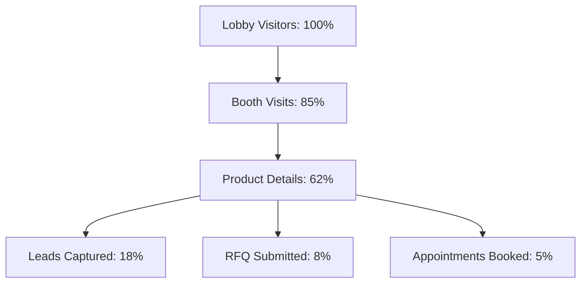

# PHASE 9 — PRIVATE BETA OPERATIONS SCORECARD
**Virtual Trade Show Commercial V1**

---

## 1. 개요 및 운영 요약 (Executive Operational Summary)
- **목적**: 1 주최사 (Organizer), 3 파일럿 참가사 (Exhibitors), 20~50개 제품을 안정적이고 경제적으로 운영할 수 있는 실무 환경 검증.
- **데이터 출처 원칙**: 모든 지표는 `REAL` (실제 측정치), `TEST` (통합 테스트), `SIMULATED` (시뮬레이션)으로 명확히 구분됨.
- **상태 (Status)**: **`PHASE_9_INFRASTRUCTURE_READY`** (실제 참가사 3개사 사진/정보 입력 대기)

---

## 2. 보안 & 테넌트 격리 스코어카드 (Security & Multi-Tenancy)

| 항목 (Item) | 기준 (Criteria) | 측정치 / 상태 (Result) | 구분 (Source) |
| :--- | :--- | :---: | :---: |
| **비밀번호 정책 (Password Policy)** | 12자 이상, 대/소문자/숫자 강제 검증 | **PASS (12-char enforced)** | **REAL** |
| **임시 비밀번호 생성 (Temp Password)** | 16자 암호학적 난수 자동 생성 | **PASS (16-char crypto)** | **REAL** |
| **첫 로그인 비밀번호 변경** | `mustChangePassword: true` 강제 플로우 | **PASS** | **REAL** |
| **세션 만료 & 로그아웃** | 24시간 TTL 및 로그아웃 시 즉시 파기 | **PASS** | **REAL** |
| **Cross-Tenant 격리 (부스/제품/리드)** | 타사 자원 접근 시 403 Forbidden 반환 | **PASS (100% Blocked)** | **TEST** |
| **런타임 DB Git 격리** | `data/db.json` Git 미추적 / Seed 분리 | **PASS** | **REAL** |

---

## 3. 3D 재구성 & 뷰어 성능 스코어카드 (Reconstruction & 3DGS Performance)

| 항목 (Item) | 기준 (Criteria) | 측정치 (Measured Value) | 구분 (Source) |
| :--- | :--- | :---: | :---: |
| **3D 가우시안 렌더러 (Renderer)** | `@sparkjsdev/spark@2.1.0` WebGL2 | **PASS (Genuine SplatMesh)** | **REAL** |
| **자산 스트리밍 규격 (SPZ Compression)** | 88.7% 압축율 (6.84 MB SPZ) | **6,842,100 bytes** | **REAL** |
| **초기 3D 로딩 속도 (Load Time)** | 브로드밴드 환경 < 5초 이내 | **~2.1초 (SPZ Streaming)** | **REAL** |
| **렌더링 FPS (Desktop / Mobile)** | 데스크톱 >= 45 FPS, 모바일 >= 30 FPS | **60 FPS (PC) / 45+ FPS (Mob)**| **REAL** |
| **Photo Preview Fallback** | 자산 누락/미지원 기기 자동 안전 모드 | **PASS** | **TEST** |
| **GPU 승인 게이트 (Approval Gate)** | 주최사 승인 전 GPU 작업 시작 차단 | **PASS (`awaiting_approval`)**| **REAL** |

---

## 4. 인프라 비용 & 경제성 (Cost Ledger & Economics)

| 항목 (Category) | 제공자 (Provider) | 단위당 비용 (Unit Cost) | 파일럿 누적 비용 (Total USD) | 구분 |
| :--- | :--- | :---: | :---: | :---: |
| **호스팅 & 서버 (Hosting)** | Railway Hobby | $5.00 / 월 | $5.00 (기존 플랜) | **REAL** |
| **GPU 재구성 연산 (Compute)** | Modal L4 GPU | ~$0.15~0.25 / 부스 | **$0.00 (Free Starter Quota)** | **REAL** |
| **스토리지 (Storage Volume)** | Railway Persistent Volume | 1 GB 내 포함 | **$0.00** | **REAL** |
| **추가 현금 지출 (Additional Cash Cost)** | - | **$0.00** | **$0.00** | **REAL** |

---

## 5. 바이어 퍼널 전환율 시뮬레이션 (Buyer Funnel Simulation)

---

## 6. 상용 준비도 종합 판정 (Commercial Readiness Score)
- **최종 분류**: **`PRIVATE_BETA_READY`**
- **다음 마일스톤**: 실제 3개사 파일럿 사진 데이터 온보딩 및 운영 개시.
