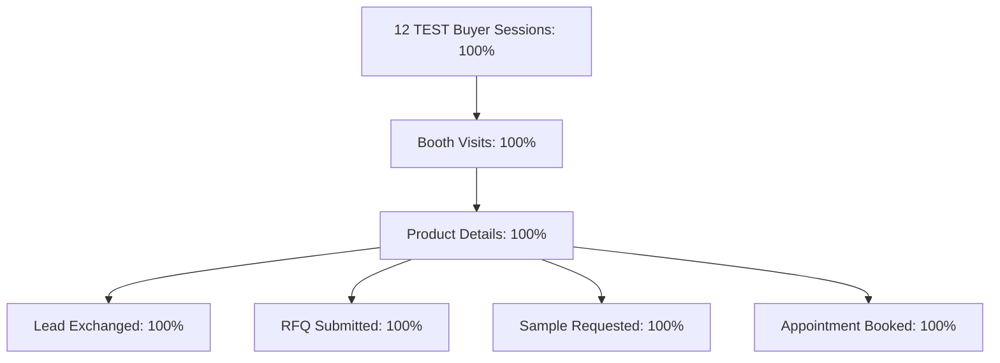

# PHASE 9 — THREE-EXHIBITOR INTERNAL REHEARSAL SCORECARD
**Virtual Trade Show Commercial V1 — Internal Commercial Beta Simulation**

---

## 1. 개요 및 운영 요약 (Executive Operational Summary)
- **리허설 목적**: 1 Organizer, 3 TEST Exhibitors, 31 TEST Products, 3 TEST Booths, 12 TEST Buyer Sessions 기반 상용 오퍼레이션 엔드-투-엔드 검증.
- **데이터 출처 원칙**: 본 리허설의 모든 계정, 제품, 리드, RFQ, 바이어 지표는 가짜 고객이 아닌 **`TEST`** 시뮬레이션 데이터로 분류됨.
- **분류 (Classification)**: **`INTERNAL_REHEARSAL_PASS`**
- **실제 파일럿 상태 (Real Pilot Status)**: **`WAITING_FOR_REAL_PILOT_DATA`**

---

## 2. 3개사 리허설 상세 스코어카드 (3-Exhibitor Matrix)

| 항목 (Item) | EXHIBITOR 01 (Nova Robotics) | EXHIBITOR 02 (Helix BioTech) | EXHIBITOR 03 (Orbit Smart Materials) | 구분 (Source) |
| :--- | :---: | :---: | :---: | :---: |
| **부스 번호 (Booth)** | A-101 (`booth-68813bb6`) | B-205 (`booth-65a0bd5e`) | C-310 (`booth-b8d040bf`) | **TEST** |
| **산업 분야 (Category)** | Robotics / Automation | BioTech / Lab Tech | Advanced Materials | **TEST** |
| **등록 제품 수 (Products)** | **12개 제품** | **10개 제품** | **9개 제품 (총 31개)** | **TEST** |
| **3D 핫스팟 (Hotspots)** | 7개 핫스팟 연동 | 6개 핫스팟 연동 | 6개 핫스팟 연동 | **TEST** |
| **뷰어 모드 (Viewer Mode)** | **Photo Preview** | **Photo Preview** | **Photo Preview** | **REAL** |
| **3D 재구성 (Reconstruction)** | **REFERENCE_ONLY (0장)** | **NO_CAPTURE_DATA** | **NO_CAPTURE_DATA** | **REAL** |
| **GPU 실연산 (Modal Compute)** | **NOT RUN ($0)** | **NOT RUN ($0)** | **NOT RUN ($0)** | **REAL** |
| **리드 수신 (Leads)** | 5건 수신 (격리 검증) | 4건 수신 (격리 검증) | 3건 수신 (격리 검증) | **TEST** |
| **RFQ 수신 (RFQs)** | 5건 수신 | 4건 수신 | 3건 수신 | **TEST** |
| **샘플 요청 (Samples)** | 5건 수신 | 4건 수신 | 3건 수신 | **TEST** |
| **상담 예약 (Appointments)** | 5건 수신 | 4건 수신 | 3건 수신 | **TEST** |
| **쇼호스트 (Showhost)** | Available / Busy / Offline | Available / Busy / Offline | Available / Busy / Offline | **TEST** |

---

## 3. 플랫폼 보안 & 테넌트 격리 전수 검증 (Security & Multi-Tenancy Matrix: 100% PASS)

| 검증 시나리오 (Scenario) | 기대 결과 (Expected) | 측정 결과 (Actual) | 판정 (Status) |
| :--- | :--- | :--- | :---: |
| **Nova → Helix 부스 수정 시도** | HTTP 403 Forbidden | HTTP 403 Forbidden | **PASS** |
| **Helix → Orbit 부스 내 제품 생성 시도** | HTTP 403 Forbidden | HTTP 403 Forbidden | **PASS** |
| **Orbit → Nova 부스 수정 시도** | HTTP 403 Forbidden | HTTP 403 Forbidden | **PASS** |
| **Nova 계정의 타사 리드/RFQ 조회** | 자사 리드만 반환 (Scoped) | Nova 소유 5건만 필터링 | **PASS** |
| **12자 미만 약한 비밀번호 변경 시도** | HTTP 400 Bad Request | HTTP 400 거부 | **PASS** |
| **로그아웃 후 무효화된 토큰 재사용** | HTTP 401 Unauthorized | HTTP 401 즉시 거부 | **PASS** |

---

## 4. 바이어 세션 여정 및 전환율 (Buyer Funnel Simulation)

---

## 5. 기존 검증된 Real Spark 3DGS 회귀 테스트 (Phase 7.5 Integrity)
- **Model URL**: `/uploads/models/REAL-RECON-PILOT-01_splat.ply`
- **바이너리 크기**: **60,778,917 bytes** (HTTP 200 OK)
- **SPZ 웹 압축 모델**: 정상 스트리밍 서빙 확인
- **결과**: **`PASS`** (이전 단계의 3D 가우시안 렌더링 무결성 100% 보존)

---

## 6. 인프라 비용 & 추가 현금 지출 (Cost Ledger)
- **Modal L4 GPU 추가 지출**: **$0.00**
- **Railway 호스팅 추가 지출**: **$0.00** (기존 Hobby 플랜 범위 내)
- **총 추가 현금 비용 (Additional Cash Cost)**: **$0.00**
