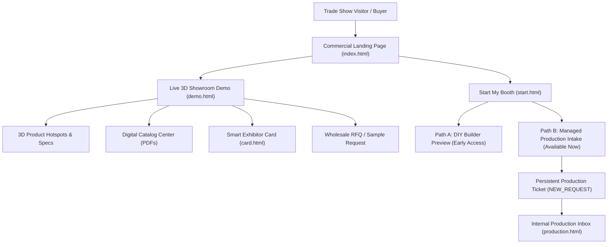

# dn’a-C01 — 02 COMMERCIAL ARCHITECTURE & PLATFORM DESIGN

**Phase**: `dn’a-C01 — COMMERCIAL DEMO & ORDER INTAKE`  
**Brand**: `dn’a — Virtual Trade Show Commercial Platform`  
**Primary Commercial Message**: *"Your Trade Show Booth Doesn't Have to End When the Show Ends."*  

---

## 1. Commercial Value Proposition

Traditional trade show exhibits require massive capital investments ($20,000 – $150,000+) for a strictly limited 4-day physical window. When the exhibition hall closes, buyer attention dissipates, and printed paper brochures are discarded.

**dn’a** transforms any physical exhibition presence into an interactive, high-impact **24/7 3D digital showroom** that serves as an evergreen sales asset:
- **Global Buyer Reach**: Accessible to international procurement teams across all time zones.
- **Direct Rep Engagement**: Integrated Smart Exhibitor Cards, instant vCard downloads, and 1-tap RFQ intake.
- **Zero Waste Literature**: Digital Catalog and spec sheet downloads embedded directly on 3D product plinths.
- **Pipeline Predictability**: Real-time buyer telemetry, dwell times, and quotation requests captured directly into the sales CRM.

---

## 2. Platform Architecture & User Journeys



---

## 3. Template-First Slot Binding Model

Rather than complex autonomous generation, dn’a operates on a reliable **Template + Customer Data = Digital Showroom** architecture:

```
[ ARCHITECTURAL 3D TEMPLATE ] (Island / Corner / In-Line)
              +
[ CANONICAL CUSTOMER DATA ] (data.json: Company, Slogan, Colors, Products, Catalogs, Reps)
              ↓
[ SLOT BINDING COMPILER ]
              ↓
[ INTERACTIVE 3D WEBGL SHOWROOM ]
```

* **Data Isolation**: Each exhibitor's showroom operates with isolated `organizationId` and `boothId`.
* **Turnaround Speed**: Managed Production leverages pre-verified 3D slots to deliver turnkey showrooms in **5 business days**.
