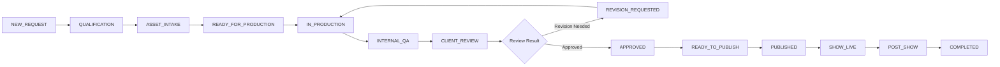

# dn’a-C02 — 02 PRODUCTION PROJECT ARCHITECTURE & LIFECYCLE MODEL

**Phase**: `dn’a-C02 — MANAGED PRODUCTION OPERATIONS`  
**Brand**: `dn’a — Virtual Trade Show Commercial Platform`  

---

## 1. Canonical Production Project Model

A production project represents a contractually bound, show-specific digital exhibition build for a B2B exhibitor:

```json
{
  "id": "proj-hpmkt-haven-01",
  "productionRequestId": "req-seed-01",
  "company": "Haven & Oak Furniture Co.",
  "contact": "Julian Vance (VP Trade Sales)",
  "email": "julian.vance@havenoak.example",
  "phone": "+1 (336) 555-0142",
  "website": "https://havenoak.example",
  "tradeShow": "High Point Market Fall 2026",
  "showStartDate": "2026-10-17",
  "showEndDate": "2026-10-21",
  "daysUntilShow": 56,
  "city": "High Point, NC",
  "venue": "IHFC Main Building",
  "boothNumber": "Stand W-412 (Interhall)",
  "industry": "Furniture, Home Decor & Lighting",
  "numberOfProducts": 12,
  "serviceSelections": ["3D_BOOTH_DESIGN", "PHOTO_TOUR", "DIGITAL_CATALOG", "SMART_CARD", "PRODUCT_QR", "RFQ_LEAD_CAPTURE"],
  "assignedProducer": "Elena Rostova (Lead 3D Producer)",
  "assignedReviewer": "Marcus Vance (QA Director)",
  "status": "PUBLISHED",
  "priority": "NORMAL",
  "blockingReason": "NONE",
  "createdAt": "2026-08-10T09:00:00.000Z",
  "updatedAt": "2026-08-22T02:00:00.000Z",
  "dueAt": "2026-09-15",
  "publishedAt": "2026-08-20T14:30:00.000Z",
  "assets": [...],
  "tasks": [...],
  "qaChecklist": {...},
  "revisions": [...],
  "clientFeedback": [...],
  "publishRecord": {...},
  "activityHistory": [...]
}
```

---

## 2. 17-State Canonical Status Lifecycle

Transitions follow an auditable, non-skipping state progression:


