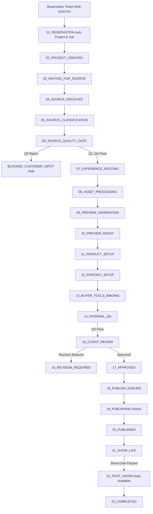

# dn’a-C06.02 — Automated Production Orchestrator Architecture

## Core Architectural Guarantees
1. **1-to-1 Mapping**: Every reservation ticket spawns exactly 1 canonical project and 1 production job (`RESERVATION_TO_PROJECT_1_TO_1 = true`).
2. **Locking & Stage Idempotency**: Jobs are acquired with atomic leases. Stage retries are idempotent and generate 0 duplicate projects, derivatives, or publish records (`DOUBLE_STAGE_EXECUTION = 0`).
3. **Traceability**: All transitions record actor, reason, execution duration, and metadata.
