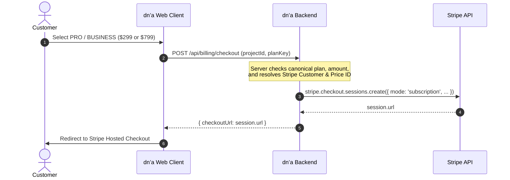

# dn’a-C07.05 — Checkout Session Flow & Validation

## Anti-Tampering Rules
1. Server strictly derives `amountCents` and `PriceId` from canonical backend registry.
2. Any client payload containing custom price, currency, or cents is rejected (`HTTP 400`).
3. Reservation ID is validated against authenticated project/user ownership.
