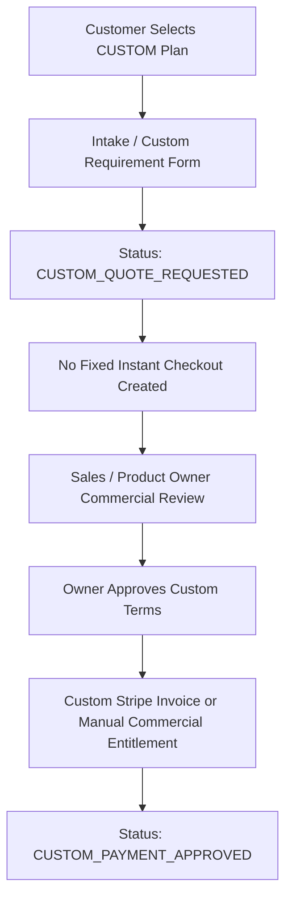

# dn’a-C07.10 — Custom Plan Qualification & Workflow

- **Zero \$0 Checkouts**: Custom plan never generates a synthetic $0 fixed checkout.
- **Enterprise Capabilities**: Upon owner approval, custom production capacity (50+ views, 500+ products, 3D twins) is unlocked.
