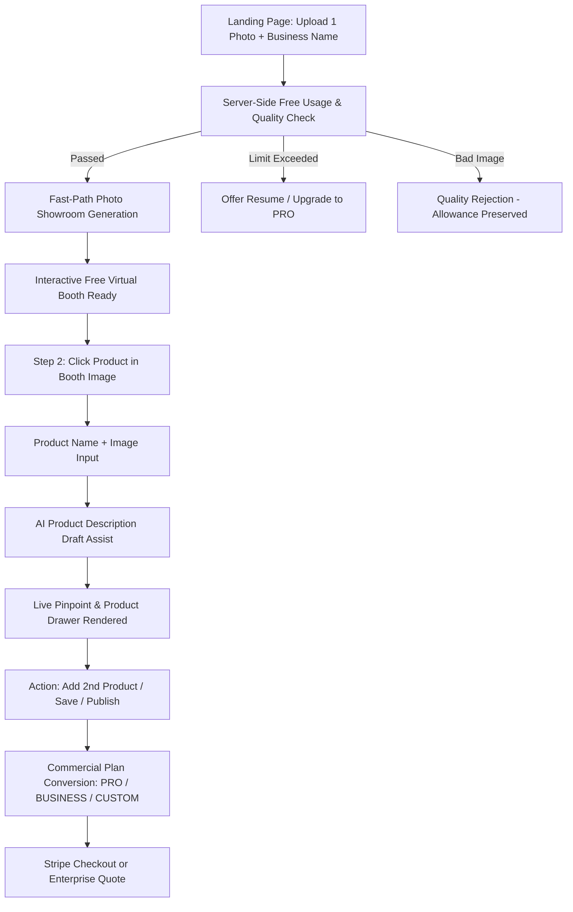

# dn’a-C08.02 — Free Funnel Architecture

## Architectural Invariants
- **No Public Free Plan**: Free usage is strictly a **1-time preview generation entitlement**, not a recurring tier.
- **Value First**: No credit card, email, or lengthy forms required before experiencing the live interactive booth.
- **Truthful Labeling**: Single 2D photos are labeled as `FREE VIRTUAL BOOTH PREVIEW` (`PHOTO_SHOWROOM`), never fabricating false 360° or hallucinated geometry.
