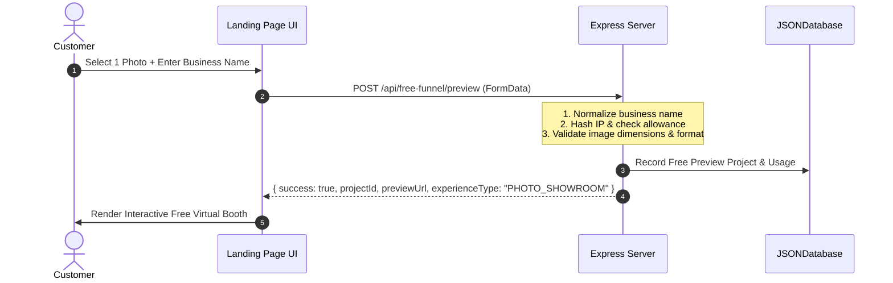

# dn’a-C08.07 — Fast-Path One-Photo Pipeline

```mermaid
sequenceDiagram
    autonumber
    actor Customer
    participant Frontend as Landing Page UI
    participant Backend as Express Server
    participant DB as JSONDatabase

    Customer->>Frontend: Select 1 Photo + Enter Business Name
    Frontend->>Backend: POST /api/free-funnel/preview (FormData)
    Note over Backend: 1. Normalize business name<br/>2. Hash IP & check allowance<br/>3. Validate image dimensions & format
    Backend->>DB: Record Free Preview Project & Usage
    Backend-->>Frontend: { success: true, projectId, previewUrl, experienceType: "PHOTO_SHOWROOM" }
    Frontend->>Customer: Render Interactive Free Virtual Booth
```

## Customer-Facing Progress Stages
1. `UPLOADING PHOTO`
2. `PREPARING YOUR BOOTH`
3. `BUILDING YOUR PREVIEW`
4. `READY`
