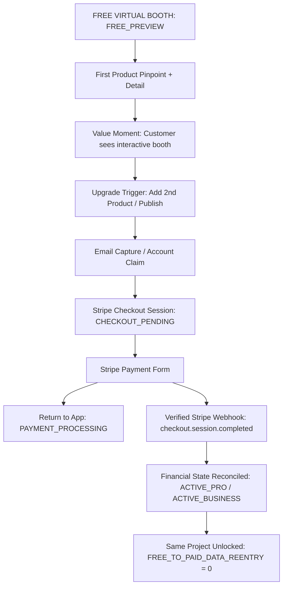

# dn’a-C09.03 — Free-to-Paid Architecture & Lifecycle

## Commercial State Invariants
- `FREE_PREVIEW` → `UPGRADE_PENDING` → `CHECKOUT_PENDING` → `PAYMENT_PROCESSING` → `ACTIVE_PRO` / `ACTIVE_BUSINESS` / `CUSTOM_QUOTE_REQUESTED`.
- Project continuity: `FREE_PROJECT_ID_PRESERVED = true`.
- Zero Data Re-entry: `FREE_TO_PAID_DATA_REENTRY = 0`.
