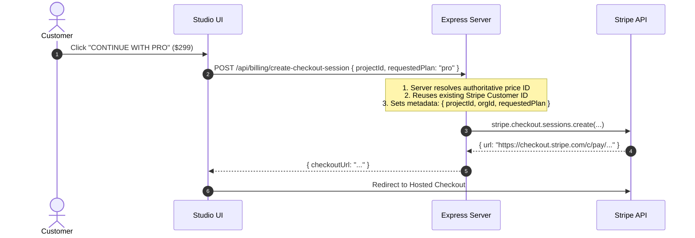

# dn’a-C09.07 — Stripe Checkout Server Authority Flow

## Security Invariants
- **Client Amounts Rejected**: The frontend cannot pass custom cent amounts or arbitrary price overrides (`CLIENT_ARBITRARY_AMOUNT_ALLOWED = false`).
- **Server-Controlled Price ID**: Server matches `requestedPlan` strictly against its canonical registry.
- **Stripe Customer Reuse**: Reuses customer record (`DUPLICATE_STRIPE_CUSTOMER_FOR_SAME_ACCOUNT = 0`).
